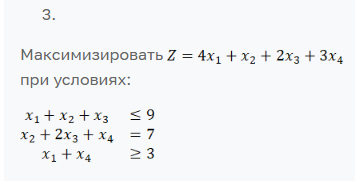
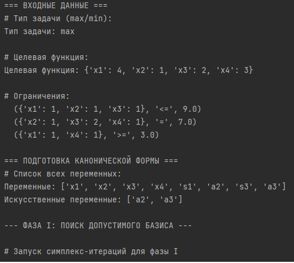
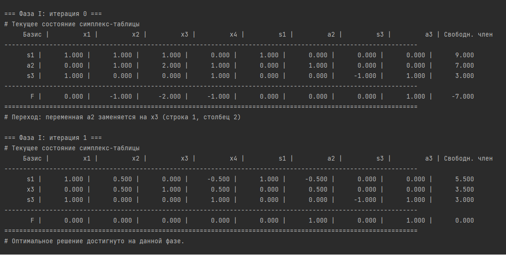
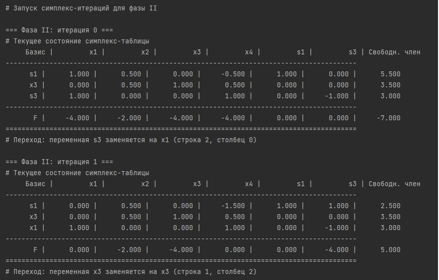
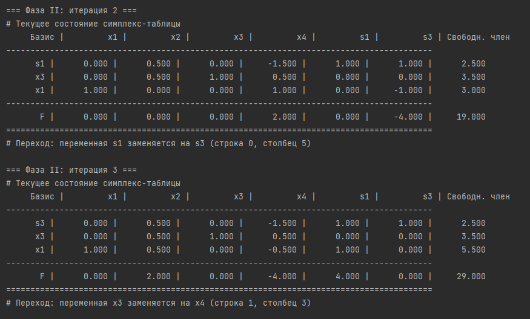
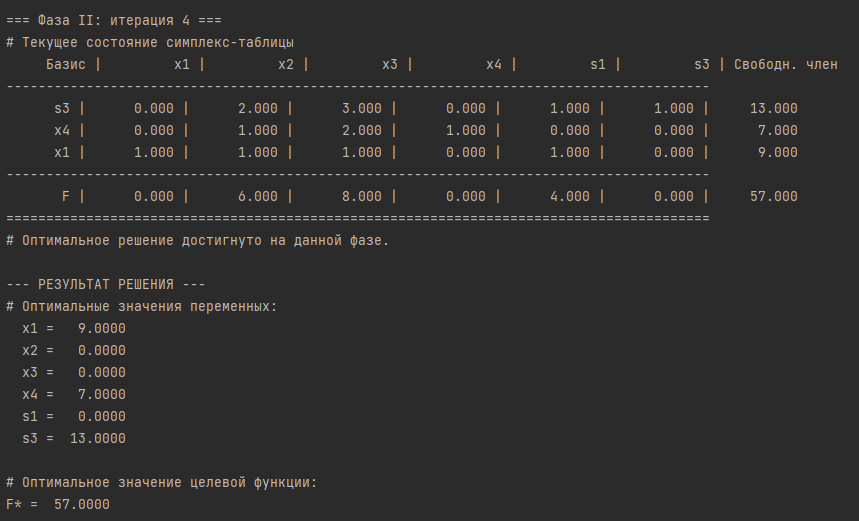
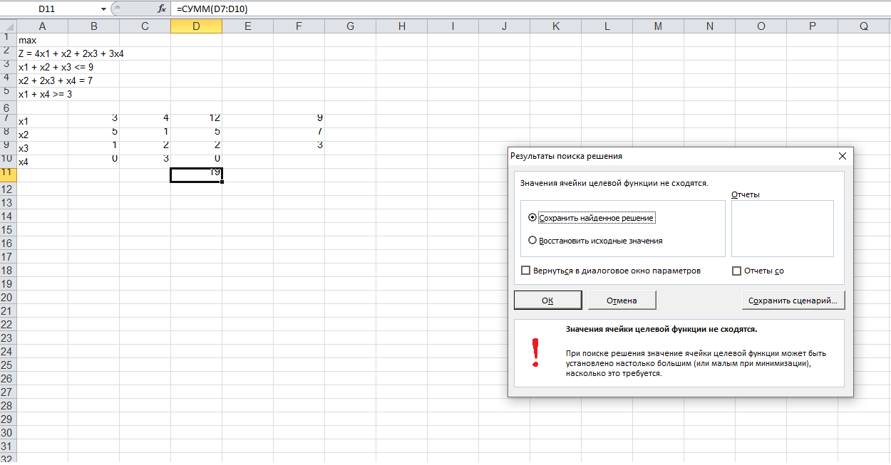

# Баженов Алексей Антонович

## МетОпт 1.2

## Описание алгоритма

## Назначение программы
Программа предназначена для решения задачи линейного программирования (ЗЛП) симплекс-методом.  
На вход подаются целевая функция и система ограничений в символьной форме.  
Результатом работы является оптимальное решение (значения переменных и целевая функция).

## Общая структура алгоритма

1. **Считывание входных данных**
   - Из файла `input.txt` считываются:
     - тип задачи (`max` или `min`);
     - целевая функция;
     - система ограничений.

2. **Парсинг уравнений**
   - Каждое ограничение преобразуется в структуру вида  
     *(массив коэффициентов, знак, правая часть)*.
   - Все переменные приводятся к единому списку.

3. **Приведение к канонической форме**
   - Для неравенств вводятся дополнительные (slack) и искусственные (artificial) переменные.
   - Формируется матрица коэффициентов `A`, вектор правых частей `b`, и вектор коэффициентов целевой функции `c`.

4. **Построение симплекс-таблицы**
   - Формируется исходная таблица с базисными и небазисными переменными.
   - Выполняются симплекс-итерации до нахождения допустимого базиса.

5. **Фаза I — поиск допустимого базисного решения**
   - Решается вспомогательная задача, минимизирующая сумму искусственных переменных.
   - При успешном завершении формируется допустимый базис для исходной задачи.

6. **Фаза II — поиск оптимального решения**
   - Подставляется исходная целевая функция.
   - Выполняются симплекс-итерации до достижения оптимума.
   - Определяются значения всех переменных и целевая функция `F*`.

7. **Вывод результатов**
   - Выводятся:
     - значения переменных;
     - оптимальное значение целевой функции;
     - симплекс-таблицы по итерациям (для анализа работы алгоритма).

## Для запуска программы необходимо загрузить файлы input.txt и main1.py в одну папку, а затем запустить main1.py.

## Вариант задания (3 вариант):

## Пример работы:

Для наглядности и проверки, я добавил в программу вывод всех этапов решения.

## Также согласно заданию я сравнил результат работы программы с работой поиска решения в экселе:

В ходе работы он не нашёл правильное решение

## Вывод

При выполнении лабораторной работы было детально изучено функционирование симплекс-метода. Самостоятельная реализация всех его шагов, включая обработку ограничений и проверку граничных случаев, способствовала более глубокому пониманию алгоритма и развитию навыков работы с массивами и индексами.